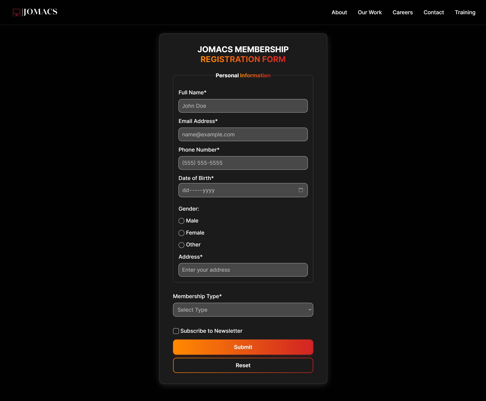
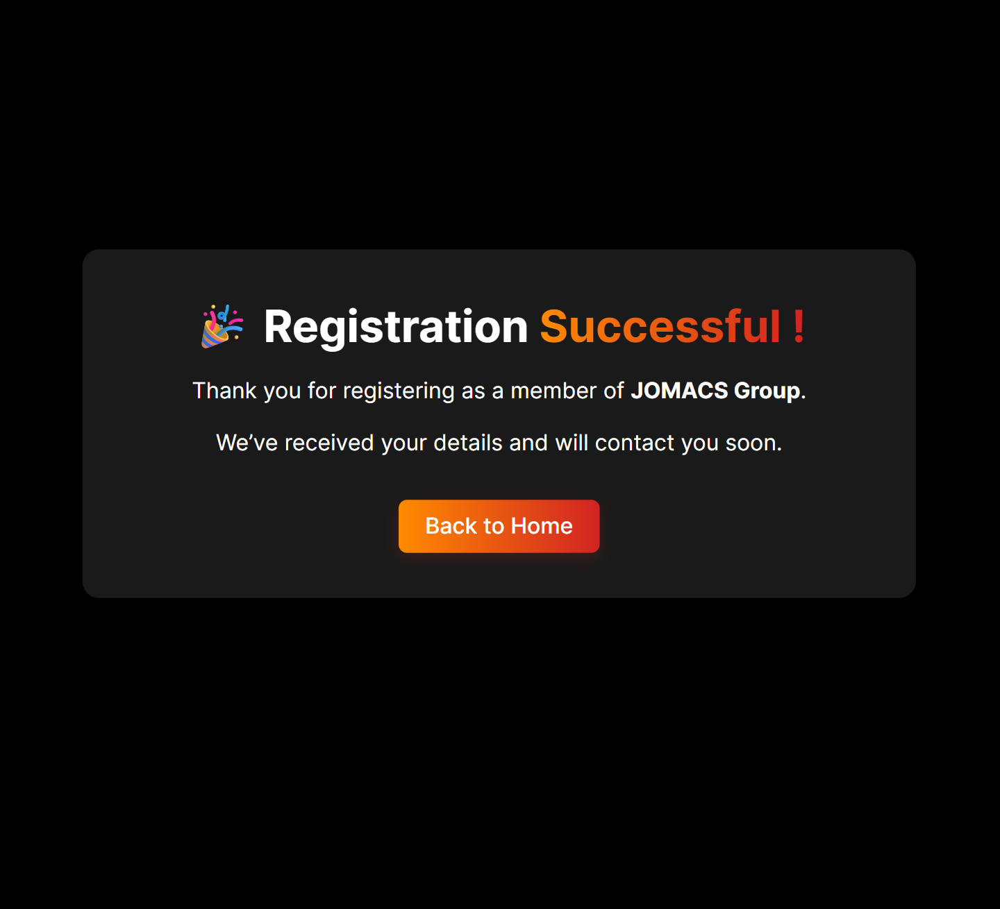
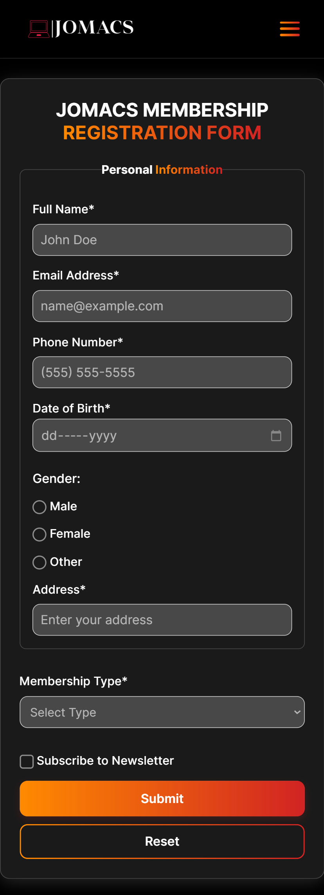
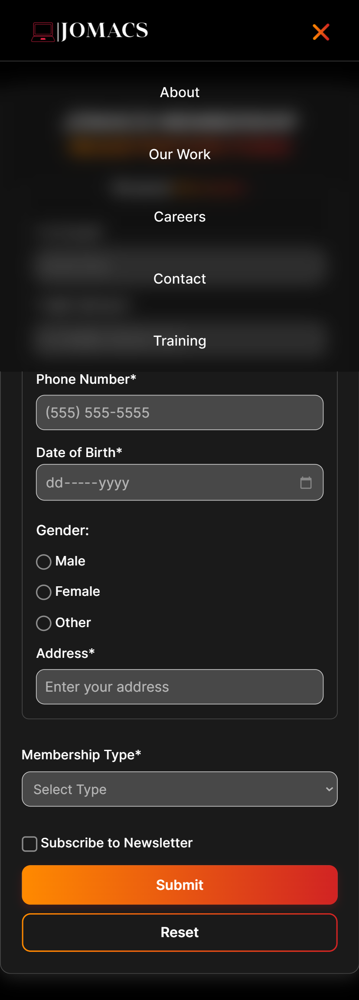

# 🧾 JOMACS Member Registration System

This project is a responsive member registration form for **JOMACS Group**, designed with **HTML, CSS, and JavaScript**, integrated with **Formspree** for backend form submission and handling.

---

## 🖥️ Project Overview

This web form allows users to register as members of **JOMACS Group**, collecting personal details such as name, email, phone number, gender, address, membership type, and also providing an option for newsletter subscription.

It features:
- A clean, frosted-glass UI design.
- Gradient accent colors.
- Responsive layout.
- Form validation.
- Integrated submission via **Formspree**.

---

## 🧱 Technologies Used

- **HTML5** – form structure and layout  
- **CSS3** – styling and responsive design  
- **JavaScript (Vanilla)** – form validation and logic  
- **Formspree API** – backend submission  
- **GitHub Pages** – hosting and deployment  

---

## ⚙️ Features

✅ Modern, responsive design  
✅ Frosted-glass visual effect  
✅ Gradient text and border styles  
✅ Form validation with required attributes  
✅ Integration with Formspree backend  
✅ Navigation bar with links  
✅ “Thank You” redirect page after submission  

---

## 📸 Screenshots

### 🧾 Registration Form

### 🎉 Thank You Page

### Mobile View – Responsive Layout

### Mobile View – Hamburger Menu Open

---

## 🚀 Live Demo

✨ **Check it out here:**  
[https://sammyb27.github.io/registration-form/]

---

## 🧠 Author

**Developed by:** [@sammyb27](https://github.com/sammyb27)  
📬 Integrated with [Formspree](https://formspree.io/)  
